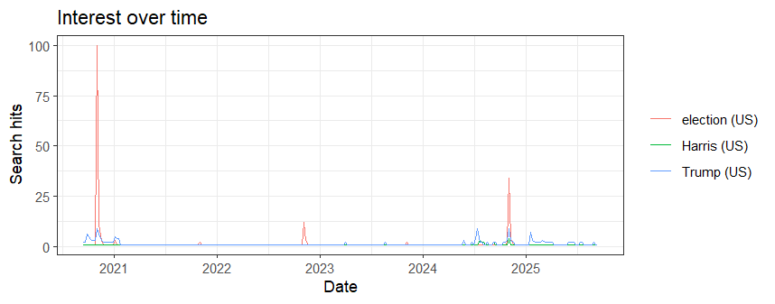

When it comes to using and gathering data from the Google Trends website and the gtrendsR Package, they differ in multiple ways, but they also share similarity of data visualization. I gathered my data from Google Trends on Trump, Kamala Harris and the elections over the last five years, and used the gtrendsR01.R package to code and provide the data about those topics, as shown on the visual above. The dates, intervals, and graphs from both methods appeared similar, demonstrating spikes of the 2020 and 2024 elections.

The Google Trends method is easy to use because individuals can categorize one column per keyword, and the date coverage can be set manually however they like. One minor setback of this method is that the data must be downloaded manually, but it's still manageable.

On the contrary, the gtrendsR package is a method that requires more work and can be complex, as it involves the use of R codes for automatic data downloads, which also requires coding knowledge. However, the repetitions are simple and can be easily scripted unlike the website, making it more efficient and reproducible once it is set up. It's also easy to code and create a CSV file through the use of R.
